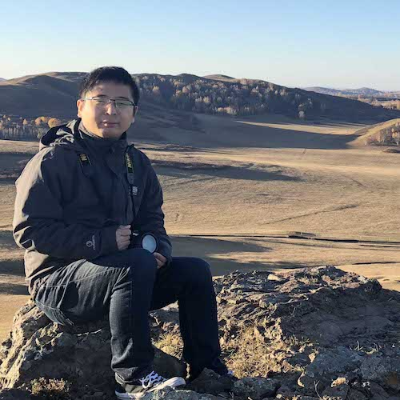

{:style="float: left; width: 240px; margin-right: 7px;:class="img-responsive"}
#### Postdoctoral researcher in [Dr. Wenyi Wang lab](https://odin.mdacc.tmc.edu/~wwang7/) at the [department of Bioinformatics and Computational Biology](https://bioinformatics.mdanderson.org/) of [the MD Anderson Cancer Center](https://www.mdanderson.org/).
